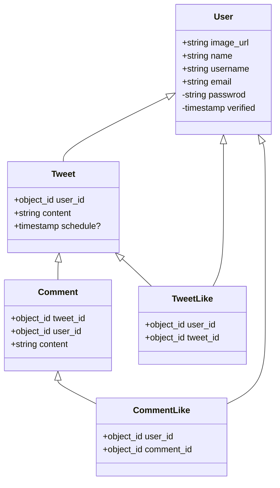

# Database

```mermaid
classDiagram
User <|-- Tweet
Tweet <|-- Comment

Tweet <|-- TweetLike
User <|-- TweetLike

Comment <|-- CommentLike
User <|-- CommentLike

class User {
 +string image_url
 +string name
 +string username
 +string email
 -string passwrod
 -timestamp verified
}

class Tweet {
 +object_id user_id
 +string content
 +timestamp schedule?
}
class TweetLike {
 +object_id user_id
 +object_id tweet_id
}

class Comment {
 +object_id tweet_id
 +object_id user_id
 +string content
}
class CommentLike {
 +object_id user_id
 +object_id comment_id
}
```

<!--
@startuml firstDiagram
Bar <-- Foo  
@enduml
-->
